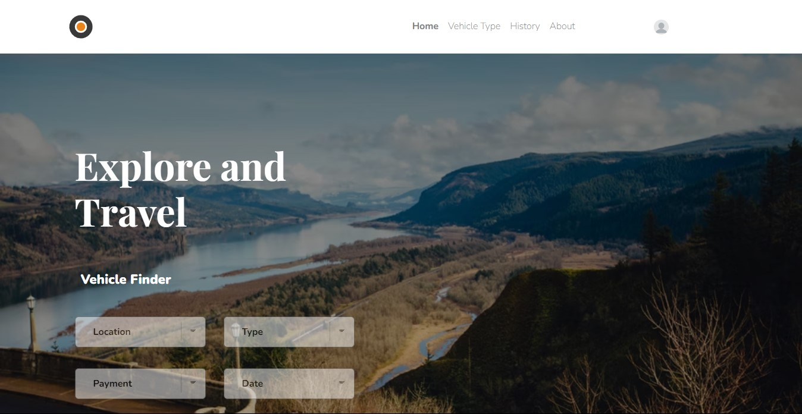

<h1 align="center">
  React With Redux: Rental Vehicle Frontend
</h1>

<p align="center"></p>

## 🔗 Click down here!

- [Live version](https://bit.ly/Rental-Vehicle-FE)

## 🛠️ Installation Steps

1. Clone the repository

```bash
git clone https://github.com/vickyelfathea/rental-vehicle-ui.git
```

2. Install dependencies

```bash
npm install
```

3. Run the app

```bash
npm start
```

🌟 You are all set!

## 💻 Built with

- [React](https://reactjs.org/)
- [Redux](https://redux.js.org/): for connecting backend
- [Styled components](https://styled-components.com/): for CSS 

<hr>
<p align="center">
Developed with ❤️ in Indonesia 	🇮🇩
</p>
